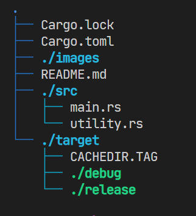

## Installation
Run the following command to build the executable:
```bash
cargo build --release
```
## Setup
Add `./target/release/ct.exe` to PATH.

## Usage
You can now run the command `ct` anywhere.
